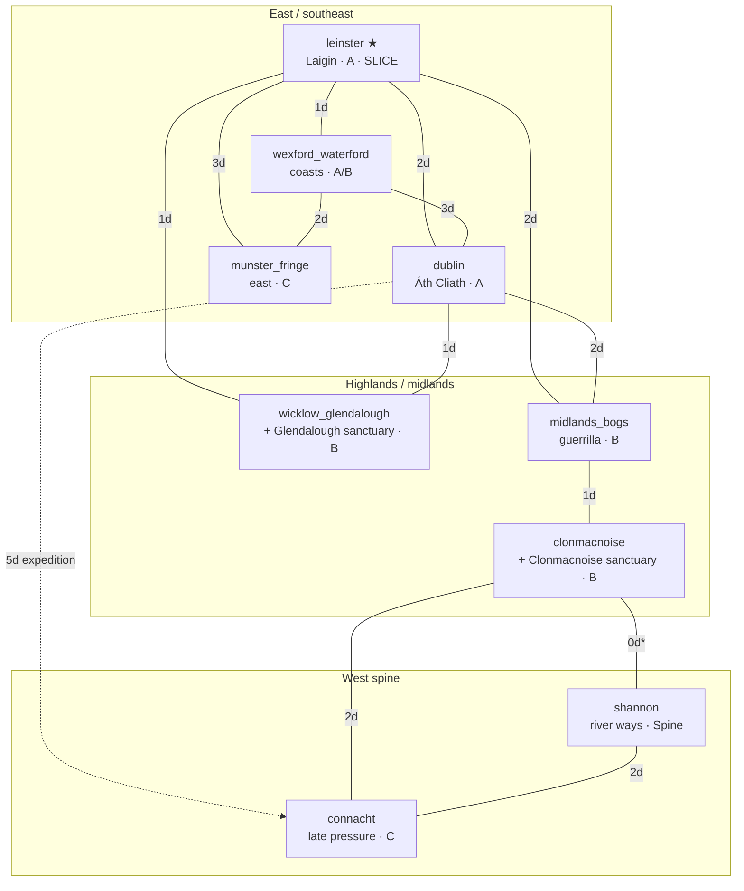
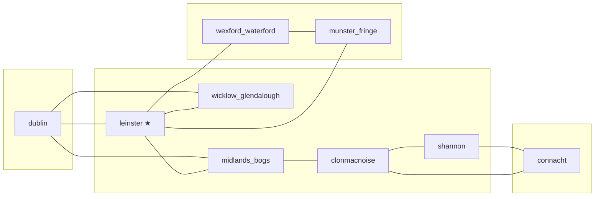

# Ríocht — World Map Regions (layout viz)

Design note: **where regions sit relative to each other** on the Ireland-wide
greybox graph. Complements [`MAP_SCALE.md`](MAP_SCALE.md) (tiers, travel days,
local meters) — this doc is the **map picture**; that doc is the **scale math**.

Runtime ids: [`TravelDistances`](../systems/traversal/travel_distances.gd)
(`REGION_IDS` / `REGION_DISPLAY`). Traversal notes:
[`systems/traversal/README.md`](../systems/traversal/README.md).

Status: **draft** (2026-10-01). **Not a playable Godot scene** — docs + data
alignment only. UI map art can later mirror these layouts.

---

## Goals

1. **One inventory** of loadable / stub region ids matching TravelDistances.
2. **Relative layout** readable at a glance (ASCII + mermaid) so designers and
   systems share the same mental map.
3. **Slice honesty** — mark what is authored roam (Leinster) vs landmark-inside
   vs graph-only stubs for Ireland expansion.
4. **Geography ↔ factions / sanctuaries** — coasts, Church precincts, and
   beachheads sit on named regions without inventing new ids.

Non-goals: GIS accuracy; every túath; a Godot `*.tscn` world map; naval fleet
sim; deriving day costs here (own those in MAP_SCALE / TravelDistances).

---

## Region inventory

Parent scale = Ireland-wide region graph (nine rows). Local greybox meters live
*inside* a region scene and are not separate inventory rows.

| Id (`TravelDistances`) | Display name | Tier ([MAP_SCALE](MAP_SCALE.md)) | Slice stance | Geography / faction notes |
|---|---|---|---|---|
| `leinster` | Laigin (Leinster) | **A — Dense** | **Authored roam** — only open-world start | Uí Chennselaig home; Cian exile fringe; **Bannow Bay** landmark (not own row); Norman beachhead day 0 |
| `wexford_waterford` | Wexford / Waterford coasts | **A/B** coastal band | Graph stub (+ landmarks / event tags from Leinster until load) | Norse-Gaelic ports; early Norman footholds; raid & trade pressure; timeline day ~14 |
| `dublin` | Áth Cliath (Dublin) | **A — Dense** | Graph stub → later densest after Leinster | Norse-Gaelic intrigue; siege set piece; rumor spine north of Leinster |
| `wicklow_glendalough` | Wicklow / Glendalough | **B — Destination** | Graph stub | Highland cover; Church sanctuary site `glendalough` → this region |
| `midlands_bogs` | Midlands bogs | **B — Destination** | Graph stub | Guerrilla / bog-body payoff terrain; west of Dublin approaches |
| `clonmacnoise` | Clonmacnoise corridor | **B — Destination** | Graph stub | Shannon monastic center; sanctuary site `clonmacnoise`; Church influence |
| `munster_fringe` | Munster fringe (east) | **C — Pressure / light** | Graph stub | Secondary conflict; coastal edge from Wexford/Waterford |
| `connacht` | Connacht | **C → denser late** | Graph stub | High King Ruaidrí pressure; western destination; prefer Shannon route |
| `shannon` | Shannon / river ways | **Spine** | Graph stub (boat gate later) | Currach / river traversal; not a “place to live”; links Clonmacnoise ↔ Connacht |

**Canonical list** must stay identical to `TravelDistances.REGION_IDS` (order may
differ for prose). Display strings match `REGION_DISPLAY`.

### Landmarks (not region rows)

| Landmark | Lives in / near | Notes |
|---|---|---|
| Bannow Bay beachhead | **Inside `leinster` greybox** | Timeline landing; overlook / event site — never a separate TravelDistances id |
| Ringfort home / wilderness exile fringe | Inside `leinster` | Local slice layout (see MAP_SCALE Leinster diagram) |
| Wexford / Waterford port tags | May start as Leinster south stubs | Until `wexford_waterford` is a loadable scene |

### Sanctuary sites → regions

| Site id | Region id | Owner faction |
|---|---|---|
| `glendalough` | `wicklow_glendalough` | `church` |
| `clonmacnoise` | `clonmacnoise` | `church` |

Source: [`systems/sanctuary/sanctuary_locations.gd`](../systems/sanctuary/sanctuary_locations.gd).

### Slice-active factions (geography)

| Faction id | Primary map weight (slice) |
|---|---|
| `ui_chennselaig` | `leinster` inland túatha / ringfort politics |
| `anglo_normans` | Bannow → coastal pressure into `wexford_waterford` |
| `norse_wexford_waterford` | Ports on `wexford_waterford` (and rumor reach into Leinster) |

Full roster (Dublin Norse, Church, High Kingship, etc.) expands as regions open
— see [`SCOPE.md`](SCOPE.md).

---

## Layout viz — Ireland greybox (relative)

North ↑. Boxes are **region graph nodes**, not km. Edge labels = **horse days**
from TravelDistances / MAP_SCALE (primary graph). Foot days are ~2× on most
roads (see matrix).

### ASCII — full nine-region roster

```
                         N
                         │
                    ┌────┴────┐
                    │ dublin  │  Áth Cliath
                    │  (A)    │
                    └────┬────┘
           1d horse │    │ 2d        5d (expedition; prefer Shannon)
                    │    │           ······························
         ┌──────────┘    └──────────┐                              ·
         │                          │                              ·
┌────────┴─────────┐     ┌──────────┴──────────┐                   ·
│ wicklow_         │     │   midlands_bogs     │                   ·
│ glendalough (B)  │     │        (B)          │                   ·
│  [Glendalough]   │     └──────────┬──────────┘                   ·
└────────┬─────────┘                │ 1d                           ·
         │ 1d                  ┌────┴─────┐                        ·
         │                     │clonmac-  │  Church corridor       ·
         │                     │noise (B) │  [Clonmacnoise]        ·
         │                     └────┬─────┘                        ·
         │                    0d*   │   2d                         ·
         │                 ┌───────┴───────┐                       ·
         │                 │   shannon     │ spine (boat later)    ·
         │                 │    (Spine)    │                       ·
         │                 └───────┬───────┘                       ·
         │                         │ 2d                            ·
         │                 ┌───────┴───────┐                       ·
         │                 │   connacht    │◄·······················
         │                 │     (C)       │
         │                 └───────────────┘
         │
┌────────┴────────┐  2d horse          ┌──────────────────┐
│    leinster     │────────────────────│ wexford_waterford│
│   (A) SLICE ★   │  1d                │   coasts (A/B)   │
│  [Bannow Bay]   │                    └────────┬─────────┘
└────────┬────────┘                             │ 2d
         │ 3d                                   │
         └──────────────┐              ┌────────┴─────────┐
                        └──────────────│ munster_fringe   │
                                       │      (C)         │
                                       └──────────────────┘

★ = authored open roam in vertical slice
* clonmacnoise→shannon horse 0 = same-day river embark
[brackets] = landmark / sanctuary site, not a region id
```

### ASCII — Leinster slice focus (what ships first)

Authored play space is **only** `leinster`. Neighbours exist as **travel-gate
destinations** (log days + stub) until their scenes exist.

```
                 [gate → dublin · 2 horse / 4 foot]
                            │
     wilderness fringe ── ringfort ── inland túatha
                            │
              ★ central Leinster roam (~2 km greybox)
                            │
                   [Bannow Bay landmark]
                            │
        [gate → wicklow_glendalough · 1 / 2]
        [gate → midlands_bogs · 2 / 4]
        [gate → wexford_waterford · 1 / 2]
        [gate → munster_fringe · 3 / 5]
```

South coastal struggle (timeline ~day 14) may resolve while the player is still
physically in the Leinster greybox — regions on the graph are for **cost +
presence checks**, not “must have loaded Wexford scene.”

### Mermaid — region graph (horse-day edges)



### Mermaid — compass sketch (relative positions)



Rough compass: **Dublin north**, **Leinster center-east**, **Wexford/Waterford
south-east**, **Munster fringe further south / south-west of ports**, **Wicklow
east-highland of Leinster**, **midlands west of Dublin**, **Clonmacnoise /
Shannon west corridor**, **Connacht far west**.

---

## Greybox vs authored (Leinster slice)

| Layer | What exists now | What this viz means |
|---|---|---|
| **Authored roam** | `leinster` scene / greybox (~Tier A diameter) | Only ★ node is walkable open world |
| **Landmarks in slice** | Bannow Bay, ringfort, south coastal stubs | Drawn *inside* Leinster; not extra REGION_IDS |
| **Graph stubs** | All other REGION_IDS + day matrix | Gates may log “would travel N days”; no second region scene required for slice |
| **Sanctuary data** | Glendalough / Clonmacnoise registry | Hang off region ids; no level geometry yet |
| **Ireland greybox scale** | MAP_SCALE day table + this layout | Same nine nodes grow depth without re-keying ids |
| **Playable map scene** | **Out of scope here** | Do not add a Godot world-map `*.tscn` for this queue item |

Expansion path: deepen `wexford_waterford` and `dublin` first after Leinster
loop proves out ([SCOPE](SCOPE.md) multi-region), keeping these layouts stable.

---

## How this complements MAP_SCALE

| Doc | Owns |
|---|---|
| **MAP_SCALE.md** | Real-world anchors, tier sizes, foot/horse day matrix, greybox meters vs graph days, timeline coupling, load-strategy notes |
| **MAP_REGIONS.md** (this) | Region inventory table, relative **layout diagrams**, landmark vs region rules, sanctuary/faction geography pins |
| **TravelDistances** | Executable REGION_IDS, DISPLAY, HORSE_DAYS / FOOT_DAYS, path helpers |

If a day number and a diagram disagree, **TravelDistances + MAP_SCALE win**;
update this viz to match.

---

## Cross-links

- Scale & days: [`docs/MAP_SCALE.md`](MAP_SCALE.md)
- Product region list: [`docs/SCOPE.md`](SCOPE.md) § Regions (full)
- Runtime graph: [`systems/traversal/travel_distances.gd`](../systems/traversal/travel_distances.gd)
- Traversal README: [`systems/traversal/README.md`](../systems/traversal/README.md)
- Sanctuaries: [`systems/sanctuary/sanctuary_locations.gd`](../systems/sanctuary/sanctuary_locations.gd)

---

## Open questions (shared with MAP_SCALE)

1. Is `wexford_waterford` a **separate loadable region** in slice, or landmarks +
   event tags inside Leinster only? (Ids stay registered either way.)
2. UI map: abstract nodes (this viz) vs stylised coast art — still **no fake km**.
3. Travel gate implementation is the next queue item after this doc.

---

## Implementation note

No new region ids were added. Inventory mirrors `TravelDistances.REGION_IDS`
exactly (nine entries). Callers and future map UI should use those StringNames
via `TravelDistances.display_name()` — do not fork a second id list in scenes.
